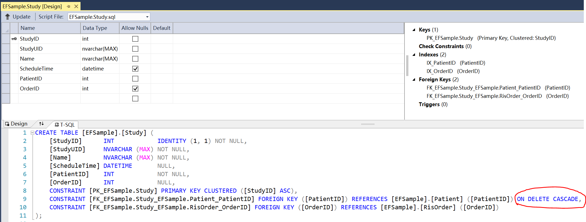

## Why choose code first
There are three major advantages to use code first:

1. Less configuration (no mapping file, no design model, no need to create table first)
2. Easier to write code (no need to build complicated model or query)
3. With some extra configuration, the generated/target database can be adapted to DBA's requirements. At least, the difficulty is less than the opposite way.

## Configure the correct connection string in DbContext
```
public EFSampleContext() : base(@"Data Source=(LocalDB)\MSSQLLocalDB; AttachDbFilename=the-path-to-local-mdf; MultipleActiveResultSets=true; Integrated Security = True; Connect Timeout = 30")
```
Please note that **MultipleActiveResultSets** by default is false, making it impossible to use DbReader nested inside loop

<!-- more -->

## Many-to-many relationship
I'll illustrate this relationship with a wildly-used user&role model.
``` 
public class Role {
	// EF is able to recognize two kinds of naming conversions: TypeID or ID
	// Personally, I prefer the former except for the case of inheritance
	public int RoleID { get; set; }

	[Required]
	public string Name { get; set; }

	// easy way to give an initialized value
	public bool Active { get; set; } = true; 
}

public class User {
	public int UserID { get; set; }

	[Required]
	public string Name { get; set; }
	
	// EF can understand normal value object as long as it has no identity	
	public Address Address { get; set; } = new Address();

	// Make it virtual so that EF can implement logic such as lazy-loading under the hood
	// Also don't forget to initialize it before using (otherwise null pointer exception is waiting for you)
	public virtual ICollection<Role> Roles { get; set; } = new HashSet<Role>();
}
```

Inside DbContext's OnModelCreating method, add the following configuration. The idea to move as many as possible of configuration (annotation) from model to a specific place is to make model independent to persistence framework to make it more general and easier to read and maintain.
```
// I prefer to add schema for each generated table
modelBuilder.Entity<Role>().ToTable("AppRole", "EFSample");

// many-to-many with one direction
// There is no link from role to user, so in this case we only need to configurate the user side
modelBuilder.Entity<User>().ToTable("AppUser", "EFSample")
	.HasMany(u => u.Roles)
	.WithMany()
	.Map(m =>
	{
		m.MapLeftKey("UserID");
		m.MapRightKey("RoleID");
		m.ToTable("User_Role", "EFSample");
	});
```

Suppose we need to loop through all users to find roles for each of them:
```
using (var ctx = new EFSampleContext()) {
	foreach (var user in ctx.Users.OrderBy(u => u.UserID)) {

		// It would load each user's role, which is lazy-loaded by default
		//ctx.Entry<User>(user).Collection<Role>(u => u.Roles).Load();

		// But since we are inside the lifetime of DbContext, just using the navigating property (Roles) directly can work
		// And this is where property "MultipleActiveResultSets" must be true
		foreach (var role in user.Roles) {
			Console.WriteLine($"{user.Name} has role: {role.Name}");
		}
	}

}
```

Suppose we need to query users who have a specific role, then:
```
using (var ctx = new EFSampleContext()) {
	var results = from u in ctx.Users
		from r in u.Roles
		where r.Name == "role 1"
		select u;
}
```

## Many-to-one and one-to-many
The many-to-one relationship here is each study belongs to one patient, while a patient can have multiple studies.
The one-to-many relationship here is an order can contain multiple studies, while each study can be (optional) included only in one order. 
```
public class Patient
{
	public int PatientID { get; set; }

	// I find required annotation is acceptable and more readable to be put in model
	// By contrast, the relationships (navigating properties) are better to put somewhere outside model
	[Required]
	public string Name { get; set; }

	// DateTime is struct. That's how to set it as optional
	public DateTime? DateOfBirth { get; set; }

	// EF has no problem to recognize enum
	public Gender? Gender { get; set; }

	// For computable properties, use NotMapped to make EF skip processing them
	[NotMapped]
	public int? Age {
		get {
			TimeSpan? span = DateTime.Now - DateOfBirth;
			if (span.HasValue) {
				return (int)Math.Ceiling(span.Value.Days / 365m);
			} else {
				return null;
			}
		}

		private set { }
	}
}

public class Study {
	public int StudyID { get; set; }

	[Required]
	public string StudyUID { get; set; }

	[Required]
	public string Name { get; set; }

	public DateTime? ScheduleTime { get; set; }
	public virtual Patient Patient { get; set; }
	public virtual Order Order { get; set; }
}

public class Order {
	public int OrderID { get; set; }

	[Required]
	public string AccessionNumber { get; set; }

	public virtual ICollection<Study> Studies { get; set; } = new HashSet<Study>();
}
```

Add the following in DbContext's OnModelCreating method to fine-tune the model:
``` 
modelBuilder.Entity<Patient>().ToTable("Patient", "EFSample");

modelBuilder.Entity<Study>().ToTable("Study", "EFSample");

// one-to-many with two directions
modelBuilder.Entity<Order>().ToTable("RisOrder", "EFSample")
	.HasMany(o => o.Studies)
	.WithOptional(s => s.Order)	// a study can have no order at all
	.Map(m => m.MapKey("OrderID")); // Name a nicer foreign key, by default, it is NavigatingPropertyName_TargetTypeID

// many-to-one with one direction
modelBuilder.Entity<Study>()
	.HasRequired(s => s.Patient) // a study must belong to a patient
	.WithMany()
	.Map(m => m.MapKey("PatientID"));
``` 

Notice that for required navigating property, the generated foreign keys will be marked as **ON DELETE CASCADE**: 
The screen-shot is


Also notice that during saving a study to an order, both of the following ways is working:
```
study.Order = anOrder;
// anOrder.Studies.Add(study)
```

Here is some example to play with the models
```
using (var ctx = new EFSampleContext()) {

	// Query male patients
	var malePatients = from p in ctx.Patients
		where p.Gender == Gender.Male
		select p;
	foreach (var patient in malePatients) {
		Console.WriteLine($"{patient.Name}");
	}

	// Loop orders and visit study and patient properties
	foreach (var o in ctx.Orders) {
		Console.WriteLine($"Order:{o.AccessionNumber}");
		foreach (var s in o.Studies) {
			Console.WriteLine($"Study:{s.Name}, Patient:{s.Patient.Name} Gender({s.Patient.Gender}) Age={s.Patient.Age ?? 0}");
		}
	}
}
```

## One-to-many self reference and table per inheritance
Category is a tree-like structure which has a point to parent and can contain more than one child categories.
Goods is an abstract class which can be represented by a series of concrete classes: Vehicle, Artwork and Estate each of which has different properties. Here I use one table to store the whole hierarchy.
AuctionItem is a model having links to user and goods, which is included here for the completeness of auction model
```
public class Category {
	public int CategoryID { get; set; }
	public string Name { get; set; }

	public virtual Category Parent { get; set; }
	public virtual ICollection<Category> SubCategories { get; set; } = new HashSet<Category>();
}

public abstract class Goods {
	public int GoodsID { get; set; }
	public string Name { get; set; }

	public virtual Category Category { get; set; }
}

public class Vehicle : Goods {
	public string Manufacturer { get; set; }
	public string Model { get; set; }
	public int? Mileage { get; set; }
}

public class Artwork : Goods {
	public string Author { get; set; }
	public string Genre { get; set; }
}

public class Estate : Goods {
	public Address Address { get; set; } = new Address();
	public decimal? Area { get; set; }
	public DateTime? BuildTime { get; set; }
}

public class AuctionItem {
	public int AuctionItemID { get; set; }
	public decimal StartingPrice { get; set; }
	public decimal? BargainPrice { get; set; }
	public DateTime? BargainTime { get; set; }

	public Goods Goods { get; set; }
	public User Bargainer { get; set; }
}

modelBuilder.Entity<Category>().ToTable("Category", "EFSample")
	.HasMany(c => c.SubCategories)
	.WithOptional(c => c.Parent)
	.Map(c => c.MapKey("ParentID"));

modelBuilder.Entity<Goods>().ToTable("Goods", "EFSample")
	.Map<Vehicle>(m => m.Requires("GoodsType").HasValue(0))
	.Map<Artwork>(m => m.Requires("GoodsType").HasValue(1))
	.Map<Estate>(m => m.Requires("GoodsType").HasValue(2));

modelBuilder.Entity<Goods>()
	.HasRequired(g => g.Category)
	.WithMany()
	.Map(m => m.MapKey("CategoryID"));

modelBuilder.Entity<AuctionItem>().ToTable("AuctionItem", "EFSample")
	.HasRequired(a => a.Goods)
	.WithMany()
	.Map(m => m.MapKey("GoodsID"));

modelBuilder.Entity<AuctionItem>()
	.HasRequired(a => a.Bargainer)
	.WithMany()
	.Map(m => m.MapKey("BargainerID"));
```

The CRUD operations in EF will be included in the other articles.
