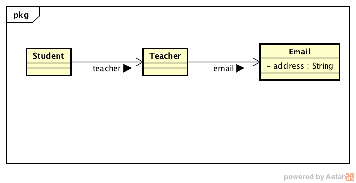

---

# What is the problem

Suppose we have models like this:

```
class Student {
  private Teacher teacher;
  public Teacher getTeacher() { return teacher; }
  public void setTeacher(Teacher teacher) { this.teacher = teacher; }
}

class Teacher {
  private Email email;
  public Email getEmail() { return email; }
  public void setEmail(Email email) { this.email = email; }
}

class Email {
  private String address;
  public String getAddress() { return address; }
  public void setAddress(String address) { this.address = address; }
}
```
(Not domain model actually, just data container)

Now given a student instance, I need to do some change to the teacher's email. How can I do? Firstly I need a way to retrieve the mail address.

# First try

The first approach is like this:
```
String teacherEmailWithEarlyBreak(Student student) {
  if (student == null) return null;
  if (student.getTeacher() == null) return null;
  if (student.getTeacher().getEmail( == null) return null;
  return student.getTeacher().getEmail().getAddress();
}
```

I'm an experienced and careful programmer and I know all the traps about NullPointerException (NPE). I prepared a couple of null checks at the beginning of the retriever method. I'm not happy that I have to type `student.getTeacher().getEmail()` twice and `student.getTeacher()` three times because I'm so lazy a person. I'm also not comfortable with so many early breaks inside a method, which is hard to maintain in comparison with expression-oriented style. So I tried a different way.

# Second try

```
String teacherEmailWithIf(Student student) {
  if (student != null
      && student.getTeacher() != null
      && student.getTeacher().getEmail() != null) {
      return student.getTeacher().getEmail().getAddress();
  } else {
      return null;
  }
}
```

I can even use ternary operator but it looks messy with those null checkings. Now I understand what the problem is. It's null checking which is tedious to write, easy to forget and hard to make it right. But I really need them, do I?

# Other thoughts

I saw IOS programmers advocate the guard clause in Swift:
```
teacherEmailWithGuard(student: Student?): String {
  guard let student = student where student != nil, 
        let teacher = student.getTeacher() where teacher != nil,
        let email = teacher.getEmail() where email != nil
        else {
          return nil
        }

  return email;
}
```
Correct me if I'm wrong with the syntax. It's been ages since I wrote Swift code. Basically, the code is still messy. I happen to know one thing called null-conditional operator, which is available in modern languages. For example in C#:
```
string TeacherEmailWithNullOperator(Student student) {
  return student?.Teacher?.Email; // won't compile
}
```

It looks wonderful but actually C# doesn't support the null operator for reference null. Anyway, I think it is the right direction I'm looking for. Let me write down the ideal application code (in Java).

# The right direction

```
String oldMail = "icanfly@qq.com";

Email aEmail = new Email();
aEmail.setAddress(oldMail); // 1

Teacher aTeacher = new Teacher();
aTeacher.setEmail(aEmail); // 2

Student aStudent = new Student();
aStudent.setTeacher(aTeacher); // 3

get(student,
  Student::getTeacher,
  Teacher::getEmail,
  Email::getAddress)
  .map(mail -> mail.replaceFirst("qq.com", "163.com"))
  .ifPresent(System.out::println); // icanfly@163.com
```
Note that if I comment out any of the lines of 1, 2 or 3, I won't get NPE but an empty print instead. So how can I create the get function so that it can access properties in any level from a root object in a NPE-free style?

# Property accessor

```
public static <R,T1> Optional<R> get(T1 root, Function<T1,R> prop1) {
  return root == null
    ? Optional.empty()
    : Optional.ofNullable(prop1.apply(root));
}

public static <R,T1,T2> Optional<R> get(T1 root, Function<T1,T2> prop1, Function<T2,R> prop2) {
  return get(root, prop1).map(t -> prop2.apply(t));
}

public static <R,T1,T2,T3> Optional<R> get(T1 root, Function<T1,T2> prop1, Function<T2,T3> prop2, Function<T3,R> prop3) {
  return get(root, prop1, prop2).map(t -> prop3.apply(t));
}

public static <R,T1,T2,T3,T4> Optional<R> get(T1 root, Function<T1,T2> prop1, Function<T2,T3> prop2, Function<T3,T4> prop3, Function<T4,R> prop4) {
  return get(root, prop1, prop2, prop3).map(t -> prop4.apply(t));
}
```

Note: 
1. continue with more get functions until T16 is sufficient in most scenarios.
2. it's strong-typed so that compiler is able to find the problem if a property accessor is incompatible with its previous or its successor.

That's it. 以上.
